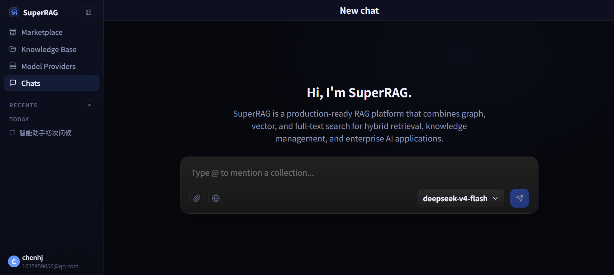
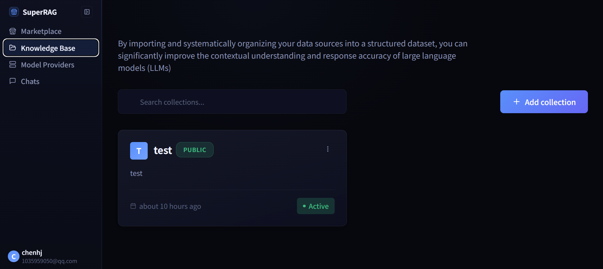
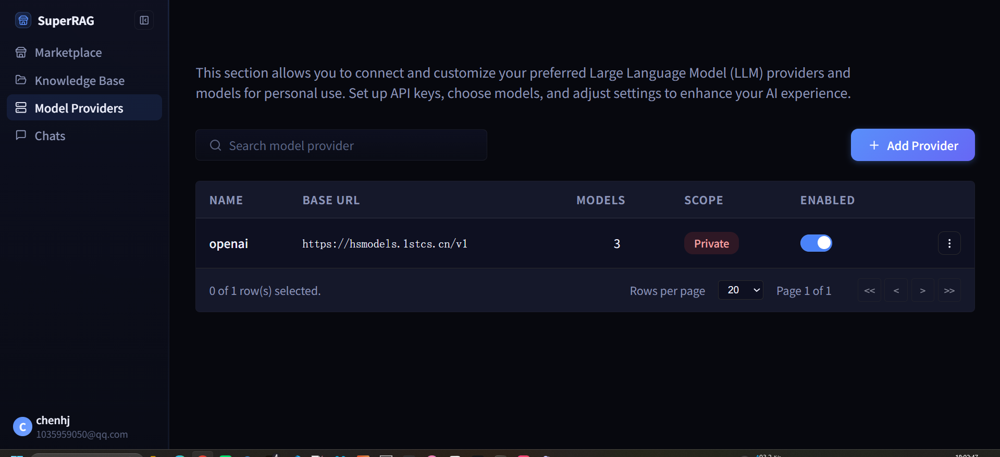
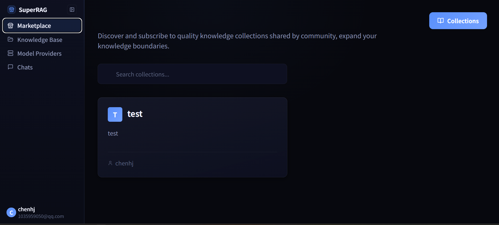

<div align="center">

# Super RAG

**企业级检索增强生成（RAG）平台** —— 集 知识库管理 · 混合检索 · 知识图谱 · 智能 Agent · 工作流引擎 于一体

<p align="center">
  <a href="http://localhost:3000" target="_blank"></a>&nbsp;
  <a href="http://localhost:8000/docs" target="_blank"></a>&nbsp;
  <a href="deploy/"></a>
</p>

<p align="center">
  <a href="super_rag/config.py"></a>&nbsp;
  <a href="https://fastapi.tiangolo.com/"></a>&nbsp;
  <a href="web/"></a>&nbsp;
</p>

<p align="center">
  <a href="#key-features">Key Features</a> ·
  <a href="#get-started">Get Started</a> ·
  <a href="#explore-super-rag">Explore</a> ·
  <a href="#tech-stack">Tech Stack</a> ·
  <a href="#configuration">Configuration</a> ·
  <a href="#community">Community</a>
</p>

</div>

---

> ✅ **Super RAG** 是一套自上而下的 RAG 平台：文档解析 → 智能分块 → 向量化 → 向量/全文混合检索 → 可选调用 LLM/工作流 → 多轮对话与流式输出，并在此基础上提供可配置的 RAG 工作流引擎（NodeFlow）与基于 MCP 的 Agent 系统。

## Key Features

Super RAG 是一个企业级的 RAG（Retrieval-Augmented Generation）平台，覆盖“从文档到回答”的完整链路，并以 Web 界面 + API 双形态交付。

- **混合检索能力** — 向量检索（语义相似度）与全文检索（关键词精确匹配）结合，支持可选重排序，兼顾语义相关性与文本命中。
- **多格式文档解析** — 支持 PDF、Word、Markdown、图片等，内置 Docling / MinerU 解析链路；配合可配置的**智能分块**策略与 OCR，稳定处理学术/复杂文档。
- **企业级知识库（Collections）** — 创建与订阅多个知识库，支持文档版本与状态跟踪、批量导入、共享与授权，作为对话中可按 `@` 引用的资产。
- **可配置 RAG 工作流（NodeFlow）** — 通过 YAML 编排节点：向量搜索、图搜索、LLM、合并、重排序、自定义，把“检索→生成”拆解为可复用的流程单元。
- **基于 MCP 的 Agent 系统** — 以 Model Context Protocol 协议构建 Agent，支持工具/技能调用、多轮上下文、流式响应，并将 Graph / Vector / Full-text 三类检索编排为同一 Agent 的能力面。
- **AI 智能助手 / Chat UI** — 多 Bot 管理、会话历史（今日/昨日分组 + 折叠/展开）、文件上传、联网搜索、`@` 知识库引用，且均可在输入框内按消息切换 Completion 模型。
- **扩展内容能力** — 播客 / 总结 / 脑图 / PPT 生成、学习计划与记忆曲线复习、视频 AI 分析、题库 / 错题本 / AI 出题判题、习惯追踪、个性化知识库与笔记等。

## Get Started

Super RAG 主要由 **FastAPI 后端 + React Web 前端** 组成，部署可选 **源码 + uv** 或 **Docker Compose**。两者共享同一套 `.env` 配置（见 [.env.example](.env.example)）。

<details>
<summary><b>Option 1 — 从源码安装（开发）</b> · 后端(FastAPI) + 前端(React), 适合二次开发与联调</summary>

前置：
- Python 3.11+
- [uv](https://docs.astral.sh/uv/) 包管理器
- Node.js 18+
- MySQL / SeekDB（向量 + 关系库），对象存储可选本地或 RustFS/S3

```bash
git clone <repository-url>
cd super-rag

# 安装依赖（项目使用 uv）
uv sync

# 初始化数据库（Alembic 迁移）
make migrate

# 启动后端 — 开发模式（热重载），http://localhost:8000
make run-dev

# 启动 Ray 调度器（后台任务，可选）
make run-ray
```

随后在独立终端启动前端 Web UI：

```bash
cd web
npm install
npm run dev   # http://localhost:3000 ，/api 代理到 :8000
```

</details>

<details>
<summary><b>Option 2 — Docker Compose 部署</b> · 一次性拉起基础设施（SeekDB + 对象存储），再挂后端/前端</summary>

```bash
cd deploy
docker compose up -d      # 启动 SeekDB (2881/2886), RustFS (9000/9001) 等
```

`deploy/` 下提供 [docker-compose.yaml](deploy/docker-compose.yaml) 与 [start.sh](deploy/start.sh)，用于在线部署时拉起数据与对象存储依赖；再把构建后的后端与 `web/dist`（或 `vite preview`）挂入应用层即可。生产建议见下方 [Deployment](#-deployment)。

</details>

## Explore Super RAG

从你日常会用到的主界面开始：**Chats（对话）· Knowledge Base（知识库）· Model Providers（模型供应商）· Marketplace（市场）**，每个模块可点开对应子块查看界面与关键操作。

<summary><b>💬 Chats — 一切的起点</b></summary>

多轮对话是 Super RAG 的主界面：左侧 **Recents** 按今日/昨日分组并可一键折叠/展开；底部输入框支持：

- **@ 引用知识库** —— 在输入框中 `@` 选择一个 Collection，作为本轮检索的来源
- **附件上传 + 联网搜索** —— 回复时可结合本地文件 / 网页结果
- **模型切换** —— 单条消息即可切换 Completion 模型（例如示例中的 `deepseek-v4-flash`）
- **流式渲染** —— Markdown / 代码块 / 公式 / 图表（Mermaid）

<div align="center">

</div>

</details>

<details>
<summary><b>🗂 Knowledge Base — 企业级知识库</b></summary>

<div align="center">
  
</div>

创建与订阅多个知识库，分别是**文档、向量索引、权限与分享**三层的实体：

- 文档上传 / 批量导入 / 版本与状态跟踪
- 可配置的**分块策略**（`CHUNK_SIZE` / `CHUNK_OVERLAP_SIZE`）
- 知识库之间的共享、订阅、Marketplace 上架
- 在对话中通过 `@` 直接把某个知识库拉进上下文

- 搜索：`POST /api/v1/collections/{id}/search`
- 上传：`POST /api/v1/collections/{id}/documents`

</details>

<details>
<summary><b>🧭 Model Providers — 模型供应商与默认模型</b></summary>

<div align="center">
  
</div>

统一管理 LLM 供应商、模型、token 参数与启用状态：

- 供应商列表 / 模型 CRUD（Context / Max Input / Max Output）
- 模型分类（completion / embedding / rerank），并按 Agent / Collection 打标
- 在 <b>/settings</b> 中按场景默认：Collection Completion · Agent Completion · Background Tasks · Embedding · Rerank
- 每个场景可自由选择 Provider、Model 以及可选的 Custom LLM Provider（例如 `openai` / `anthropic` / `bedrock`）

</details>

<details>
<summary><b>🏪 Marketplace — 社区知识库订阅</b></summary>

<div align="center">
  
</div>

面向社区的知识库订阅源：发现 / 订阅公开共享的 Collection（带发布者），也允许把自己的知识库上架 / 下架。

- 上架：在 Knowledge Base 页点击 "..." → Publish to Marketplace
- 订阅：在 Marketplace 页点击卡片 → Subscribe，本地即获得一份只读引用

</details>

<details>
<summary><b>⚙️ NodeFlow — 可配置 RAG 工作流</b></summary>

把“检索 → 生成”拆解为可编排的节点图，YAML 驱动：

- **向量搜索** / **图搜索** / **LLM** / **合并** / **重排序** / 自定义
- 节点参数：top_k、字段映射、后处理、 Failover
- 与 Chat / API 无侵入对接，工作流 ID 即可作为 Chat 的“后处理引擎”

</details>

## Tech Stack

### 后端
- **框架**: FastAPI
- **语言**: Python 3.11+
- **数据库**: MySQL / OceanBase (通过 SeekDB 接入)
- **向量检索**: SeekDB（同时支持向量与全文检索）
- **对象存储**: RustFS（S3 兼容）/ 本地存储
- **任务调度**: Ray
- **ORM**: SQLAlchemy (异步)
- **数据库迁移**: Alembic

### 核心依赖
- **LLM 集成**: LiteLLM（OpenAI / Anthropic / DeepSeek / ModelScope 等）
- **文档解析**: Docling, MinerU
- **向量化**: 多种 Embedding 模型可插拔
- **Agent 框架**: MCP Agent, MS Agent
- **可观测性**: OpenTelemetry

### 前端
- React 18 + TypeScript（Vite）
- React Router · Axios · Lucide 图标
- 渲染层：react-markdown · KaTeX（数学公式）· Mermaid（图/表）

## Project Structure

```
super-rag/
├── super_rag/              # 主应用（FastAPI）
│   ├── agent/              # Agent 运行时
│   ├── agent_pro/          # Agent Pro（高级编排）
│   ├── api/                # API 路由（bot / chat / collections / llm …）
│   ├── chunk/              # 文档分块
│   ├── db/                 # 数据库模型与仓库
│   ├── fileparser/         # 文档解析器
│   ├── graphiti/           # 图结构支持
│   ├── index/              # 索引管理
│   ├── llm/                # completion / embed / rerank
│   ├── mcp/                # MCP 协议集成
│   ├── nodeflow/           # RAG 工作流引擎
│   ├── objectstore/        # 对象存储适配（local / S3）
│   ├── service/            # 业务服务
│   ├── tasks/              # Ray 后端任务
│   ├── trace/              # 可观测性与追踪
│   └── vectorstore/        # 向量/全文存储连接器
├── web/                    # React Web UI（Vite）
├── config/                 # 运行配置
├── deploy/                 # Docker Compose 部署
├── scripts/                # 运维/迁移脚本
├── migration/              # Alembic 迁移
└── pyproject.toml          # uv 项目配置
```

## Configuration

主要配置项通过 `.env` 设置（完整列表见 [super_rag/config.py](super_rag/config.py) 与 [.env.example](.env.example)）：

| 变量 | 说明 | 默认 |
|:---|:---|:---|
| `MYSQL_HOST` / `MYSQL_PORT` | MySQL / OceanBase 主机与端口 | `127.0.0.1` / `2881` |
| `MYSQL_DB` / `MYSQL_USER` / `MYSQL_PASSWORD` | 数据库账号 | `super_rag` / `root` / `123456` |
| `VECTOR_DB_TYPE` | 向量库后端 | `seekdb` |
| `VECTOR_DB_CONTEXT` | SeekDB 连接 JSON | 见 .env.example |
| `OBJECT_STORE_TYPE` | 对象存储 | `local` |
| `OBJECT_STORE_LOCAL_ROOT_DIR` | 本地对象存储根 | `.objects` |
| `CHUNK_SIZE` / `CHUNK_OVERLAP_SIZE` | 分块大小 / 重叠 | `400` / `20` |
| `MAX_DOCUMENT_SIZE` | 单文档上限（字节） | `100 * 1024 * 1024` |
| `CACHE_ENABLED` | 是否启用缓存 | `true` |
| `DEBUG` | 开发模式 | `false` |

### 模型配置

LLM 模型配置由 `model_configs.json` 管理，按使用者隔离；前端通过 **Settings → 默认模型** 完成各场景（Collection / Agent / Background / Embedding / Rerank）的 Provider + Model 配置。

## Development

| 命令 | 说明 |
|:---|:---|
| `make help` | 展示全部命令 |
| `make makemigration` | 生成 Alembic 迁移 |
| `make migrate` | 应用迁移 |
| `make downgrade` | 回滚一次迁移 |
| `make run-dev` | 开发模式启动（热重载） |
| `make run-prod` | 生产模式启动 |
| `make run-ray` | 启动 Ray 调度器（后台任务） |
| `uv run pytest` | 运行测试 |
| `cd web && npm run dev` | 本地前端开发（:3000） |

代码风格建议：`black` 格式化、`ruff` lint、`mypy` 类型检查。

## Deployment

部署建议：
1. **数据库** — 独立 MySQL / OceanBase 实例
2. **向量检索** — 使用生产级 SeekDB 或同等向量+全文引擎
3. **对象存储** — 生产级 S3 服务或 RustFS 集群
4. **缓存 / 调度** — Redis 可选；Ray 在负载高时独立部署
5. **可观测** — OpenTelemetry 接入链路追踪 + 集中日志
6. **安全** — HTTPS、API 密钥管理、启用用户认证，按需启用外发内容过审

环境变量（生产）建议使用：Kubernetes Secrets / HashiCorp Vault / AWS Secrets Manager 等。

## Community

### Contact

Super RAG 是一个 **持续演进中的开源项目**，面向企业级 RAG 场景进行设计与打磨，以完全开源的方式对外提供。如果有讨论、建议或合作意愿，欢迎通过 [GitHub Issues](https://github.com/)（代建仓库后指向对应 org）或仓库 Maintainers 邮箱联系。

### Roadmap

- 图搜索（GraphRAG）与 Chart / Video 生成节点
- 多租户配额与工作流模板市场
- PPT / 播客 / 研究论文的模板化生成
- 更细粒度的 RAG 评估与可观测面板

### Contribute

1. Fork 仓库 → `git checkout -b feature/your-feature`
2. 提交：`git commit -m 'feat: ...'`
3. `git push origin feature/your-feature` 并创建 PR，建议附上演示截图或复现命令

---

<p align="center"><b>Super RAG</b> · 一站式企业级 RAG 平台 · <sub>基于 FastAPI · React · SeekDB · LiteLLM · MCP</sub></p>
<p align="center"><sub>License · 待补充（见仓库 LICENSE）</sub></p>
