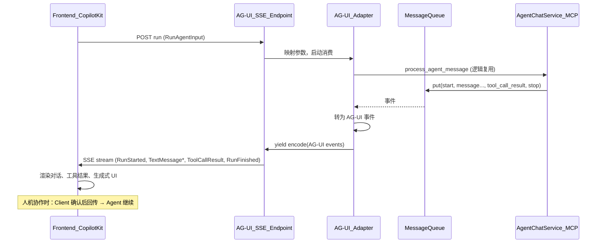

# AG-UI 协议接入方案

## 1. 现状与目标

**当前架构（简要）**

- **后端**：[super_rag/service/agent_chat_service.py](../../super_rag/service/agent_chat_service.py) 通过 WebSocket (`/api/v1/agents/{agent_id}/chats/{chat_id}/connect`) 处理 Agent 聊天，向队列写入自定义事件：`start`、`message`（流式）、`stop`、`tool_call_result`、`thinking`、`error`；[super_rag/agent/stream_formatters.py](../../super_rag/agent/stream_formatters.py) 与 [super_rag/agent/response_types.py](../../super_rag/agent/response_types.py) 定义这些事件结构。
- **前端**：[super-rag-frontend/frontend/src/pages/ChatsPage.tsx](../../super-rag-frontend/frontend/src/pages/ChatsPage.tsx) 仅处理 `start`、`message`、`stop`、`error`；**未单独渲染** `tool_call_result` 与 `thinking`（工具结果目前可能被合入文案或未展示）。
- **Agent 栈**：MCP Agent（[super_rag/agent/agent_session_manager.py](../../super_rag/agent/agent_session_manager.py)），非 LangGraph；工具结果由 [super_rag/agent/agent_event_processor.py](../../super_rag/agent/agent_event_processor.py) 监听 MCP 事件后格式化为 `tool_call_result` 入队。

**目标**

- 使用 **AG-UI 协议** 连接 Agent 与前端，发送标准事件并在前端渲染。
- 支持：**工具结果渲染**、**生成式 UI**（如表格/卡片）、**人机协作**（敏感操作前请求用户确认）。
- 尽量采用 **现成 AG-UI 生态**（Python 服务端 + CopilotKit 或其它 AG-UI 客户端），减少自研协议与 UI 逻辑。

---

## 2. 技术选型

| 层级 | 选型 | 说明 |
|------|------|------|
| 协议 | AG-UI 事件流 | RunStarted/RunFinished、TextMessage*、ToolCall*、ActivitySnapshot、Custom 等（[Events 文档](https://docs.ag-ui.com/concepts/events)） |
| 后端 | `ag-ui-protocol` Python + 自研适配层 | 当前 Agent 为 MCP 非 LangGraph，不直接用 ag-ui-langgraph；用官方 Python 的 EventEncoder + 事件类型，在现有流程上做「当前事件 → AG-UI 事件」映射并输出 SSE |
| 传输 | SSE（首选）或 WebSocket | AG-UI 支持多种传输；SSE 与 CopilotKit 对接简单，与现有 WebSocket 可并存 |
| 前端 | CopilotKit（React） | 官方推荐的 AG-UI 客户端，内置流式对话、工具调用/结果、生成式 UI、人机协作能力 |

---

## 3. 后端方案

### 3.1 新增 AG-UI SSE 端点

- **路径建议**：`POST /api/v1/agents/{agent_id}/chats/{chat_id}/ag-ui` 或 `/api/v1/ag-ui/agents/{agent_id}/chats/{chat_id}/run`，请求体为 AG-UI 的 `RunAgentInput`（含 `thread_id`、`run_id`、`messages` 等），与现有 WebSocket 的 `AgentConnectPayload` 在业务上等价，需做一层参数映射。
- **依赖**：在 `super_rag` 中引入 `ag-ui-protocol`（或官方仓库中 Python 包名，如 `ag_ui`），使用其 `EventEncoder` 与事件类型（如 `RunStartedEvent`、`TextMessageContentEvent`、`ToolCallResult`、`RunFinishedEvent`、`RunErrorEvent` 等）。
- **流程**：
  1. 解析请求 → 映射为现有 `AgentMessage`/会话参数，复用 `AgentChatService.process_agent_message` 的核心逻辑（会话获取、记忆、LLM 调用、工具执行）。
  2. 不再向现有 `AgentMessageQueue` 写「自定义事件」，而是由 **AG-UI 适配层** 消费同一套执行过程，并 **按 AG-UI 规范** 发送事件：
     - 开始：`RunStarted`（thread_id=chat_id, run_id=message_id）。
     - 流式文本：`TextMessageStart` → 多次 `TextMessageContent`（delta）→ `TextMessageEnd`。
     - 工具调用：在检测到工具调用时发送 `ToolCallStart` / `ToolCallArgs` / `ToolCallEnd`，工具执行完成后发送 `ToolCallResult`。
     - 思考链（若有）：`ReasoningMessageChunk` 或 Reasoning* 系列事件。
     - 进度/结构化展示：`ActivitySnapshot` 或 `Custom`（见下「生成式 UI」）。
     - 结束：`RunFinished` 或 `RunError`。
  3. 使用 FastAPI `StreamingResponse` + `EventEncoder.encode()`，`Accept` 头与 `media_type` 按 AG-UI 文档设置。

### 3.2 当前事件到 AG-UI 的映射（核心）

| 当前事件 | AG-UI 事件 |
|----------|------------|
| start (id=msg_id) | RunStarted(thread_id=chat_id, run_id=msg_id) |
| message (流式 data) | TextMessageStart → TextMessageContent(delta) → TextMessageEnd |
| tool_call_result | ToolCallResult(messageId, toolCallId, content) |
| thinking | ReasoningMessageChunk / ReasoningStart–ReasoningEnd |
| stop | RunFinished(thread_id, run_id) |
| error | RunError(message) |

实现方式二选一或组合：

- **方式 A**：在现有 `process_agent_message` 与 `_consume_messages_from_queue` 旁路一条「AG-UI 消费者」：队列中仍写入现有事件，适配器订阅队列，将每个事件转换为 AG-UI 事件并写入 SSE 流。
- **方式 B**：为 AG-UI 单独走一套「流式执行路径」：直接驱动 LLM 流式输出与工具调用，在关键节点产生 AG-UI 事件并 yield 到 SSE，不经过现有队列。便于精确控制 ToolCallStart/Args/End 与 ToolCallResult 的时机。

推荐先做 **方式 A**（复用现有队列与逻辑），保证行为一致且改动集中；若后续需要更多人机协作或更细粒度工具流，再考虑方式 B。

### 3.3 工具结果渲染

- 现有逻辑已在 `AgentEventProcessor` 中根据工具结果生成 `tool_call_result`（含 `tool_name`、`data` 等）。
- 适配层将每条 `tool_call_result` 转为 AG-UI 的 `ToolCallResult`（含 `messageId`、`toolCallId`、`content`）。前端 CopilotKit 会自动渲染工具结果。
- 若希望 **结构化展示**（如表格、卡片），可在后端对特定工具（如检索、列表）额外发送 **ActivitySnapshot**（activityType 如 `"SEARCH_RESULTS"`，content 为结构化数据）或 **Custom** 事件，前端注册对应组件渲染（见前端章节）。

### 3.4 人机协作（请求用户确认）

- AG-UI 的人机协作通常通过「需确认的工具」实现：Agent 发起工具调用，前端在 **执行前** 拦截并弹出确认 UI，用户确认或拒绝后再把结果回传给 Agent。
- 实现要点：
  - **后端**：对需确认的工具（如删除、写库），在真正执行前不直接调用工具实现，而是先通过 AG-UI 流发送该次工具调用的 `ToolCallStart`/`ToolCallArgs`/`ToolCallEnd`，并 **等待** 前端返回的「确认结果」（通过 CopilotKit 的 frontend tool 或 AG-UI 定义的回调机制）。收到确认后再执行真实工具并发送 `ToolCallResult`；若拒绝则发送取消或错误结果的 `ToolCallResult`。
  - **前端**：使用 CopilotKit 的 `useCopilotAction` 或「需确认工具」能力，在工具被调用时展示确认弹窗，将用户选择作为工具结果返回。
- 若 AG-UI/CopilotKit 的「需确认」是前端拦截工具执行并先发回一个 pending/confirm 结果，则后端需支持：收到这类结果后再继续执行真实工具并再次发送 `ToolCallResult`。具体以 CopilotKit 文档为准。

### 3.5 生成式 UI 示例

- 在合适时机（如检索完成、列表类工具返回）发送 **ActivitySnapshot** 或 **Custom** 事件，例如：
  - `ActivitySnapshot`：`messageId`、`activityType: "SEARCH_RESULTS"`、`content: { items: [...], columns: [...] }`。
  - `Custom`：`name: "generative_table"`、`value: { component: "DataTable", props: { data, columns } }`。
- 前端根据 `activityType` 或 `name` 注册 React 组件（表格、图表等），CopilotKit 会把这些事件渲染为生成式 UI。

### 3.6 与现有 WebSocket 的兼容

- 保留现有 WebSocket 端点与协议不变，新增加 AG-UI SSE 端点；通过配置或前端入口（如「新版对话」入口）选择使用 AG-UI 或旧版 WebSocket，便于灰度与回滚。

---

## 4. 前端方案

### 4.1 接入 CopilotKit

- 在对话页（或新页面）引入 `@copilotkit/react-core` 与 `@copilotkit/react-ui`，使用 `CopilotKit` 的 `runtimeUrl` 指向上述 AG-UI SSE 端点（需带 agent_id、chat_id 及认证），并使用 `CopilotChat`（或 headless `useCopilotChat`）渲染对话。
- 请求格式：CopilotKit 会按 AG-UI 规范发送 `RunAgentInput`（含 messages、thread_id、run_id 等）；后端需从 body 中解析并映射到现有 `agent_id`、`chat_id`、用户与消息。

### 4.2 工具结果与生成式 UI

- 工具结果：CopilotKit 解析 AG-UI 的 `ToolCallResult` 并展示，一般无需额外代码；若有自定义展示需求，可在 CopilotKit 的渲染扩展中根据 `toolCallId`/工具名定制。
- 生成式 UI：根据后端发的 `ActivitySnapshot`/`Custom` 注册组件（如表格、图表），在 CopilotKit 的 generative UI 或 custom message 中渲染。

### 4.3 人机协作示例

- 定义「需确认」的 CopilotKit action（或 frontend tool），参数与后端需确认的工具一致；在 handler 中弹出确认框，根据用户选择返回 `{ confirmed: true/false, reason?: string }`；后端将该结果视为工具结果继续或取消执行。

### 4.4 类型与兼容

- 前端可继续保留现有 `ChatCompletionResponse` 等类型给旧 WebSocket 路径；AG-UI 路径使用 CopilotKit 提供的类型或 AG-UI 的 TypeScript 类型（若有）。
- 若同一聊天页支持「旧版 / AG-UI」切换，可用同一 `messages` 数据源，仅切换连接方式（WebSocket vs CopilotKit runtimeUrl）。

---

## 5. 实现顺序建议

1. **后端**：安装 `ag-ui-protocol`（或对应 Python 包），实现最小可用 AG-UI SSE 端点：仅支持 RunStarted → TextMessageStart/Content/End → RunFinished，请求体与现有聊天参数映射，内部调用现有 `process_agent_message` 或等价逻辑，通过队列消费转为 AG-UI 事件（方式 A）。
2. **前端**：在现有项目中接入 CopilotKit，`runtimeUrl` 指向该 SSE 端点，实现基础流式对话与消息展示。
3. **后端**：在适配层增加 `tool_call_result` → `ToolCallResult`，并补全 `ToolCallStart`/`ToolCallArgs`/`ToolCallEnd`（若当前有工具调用元数据可发）。
4. **前端**：确认工具调用与工具结果在 CopilotKit 中正常显示；必要时为特定工具做自定义展示。
5. **后端 + 前端**：为 1～2 个工具增加生成式 UI（ActivitySnapshot/Custom + 前端组件）。
6. **后端 + 前端**：为人机协作选一个「需确认」工具（如删除），实现后端等待确认与前端确认弹窗，完成闭环。

---

## 6. 关键文件与改动点

- **后端**
  - 新模块：如 `super_rag/ag_ui/`（或 `super_rag/api/ag_ui.py`）：AG-UI 请求模型、事件映射、SSE 流生成。
  - 新路由：在 `super_rag/api/` 下注册 `POST .../ag-ui`（或等价路径），调用 `AgentChatService` 与 AG-UI 适配层。
  - 依赖：`requirements*.txt` 或 `pyproject.toml` 增加 `ag-ui-protocol`（以 PyPI 实际包名为准）。

- **前端**
  - 依赖：`@copilotkit/react-core`、`@copilotkit/react-ui`（及 CopilotKit 要求的 AG-UI 相关包）。
  - 对话页或新页：包裹 `CopilotKit` + `CopilotChat`，配置 `runtimeUrl`、认证（若需要）。
  - 可选：生成式 UI 组件注册、人机协作确认弹窗组件。

- **配置**
  - 环境变量或应用配置：AG-UI 端点 base URL、是否默认使用 AG-UI 等，便于切换与部署。

---

## 7. 风险与注意点

- **包名与 API**：Python 端需确认 PyPI 上为 `ag-ui-protocol` 还是其他名称，以及是否提供 `EventEncoder`、`RunStartedEvent` 等；文档示例为 `ag_ui.core` / `ag_ui.encoder`，可能与仓库内包结构一致，集成时以实际包为准。
- **认证与多租户**：AG-UI 端点需与现有鉴权（如 `default_user`、agent_id/chat_id 归属）一致，避免越权访问。
- **双协议并存**：同一 chat 若同时存在 WebSocket 与 AG-UI 连接，需避免重复执行或状态错乱（例如同一 message_id 只允许一种连接处理）。
- **人机协作的请求/响应格式**：以 CopilotKit 与 AG-UI 官方文档为准，确认「需确认工具」的请求与返回格式，再在后端实现「等待确认再执行」的逻辑。

---

## 8. 架构示意（事件流）

以上为 AG-UI 协议接入的完整方案，后端以「现有队列 + AG-UI 适配层」输出 SSE，前端以 CopilotKit 消费并实现工具结果、生成式 UI 与人机协作，同时保留现有 WebSocket 兼容与灰度能力。
